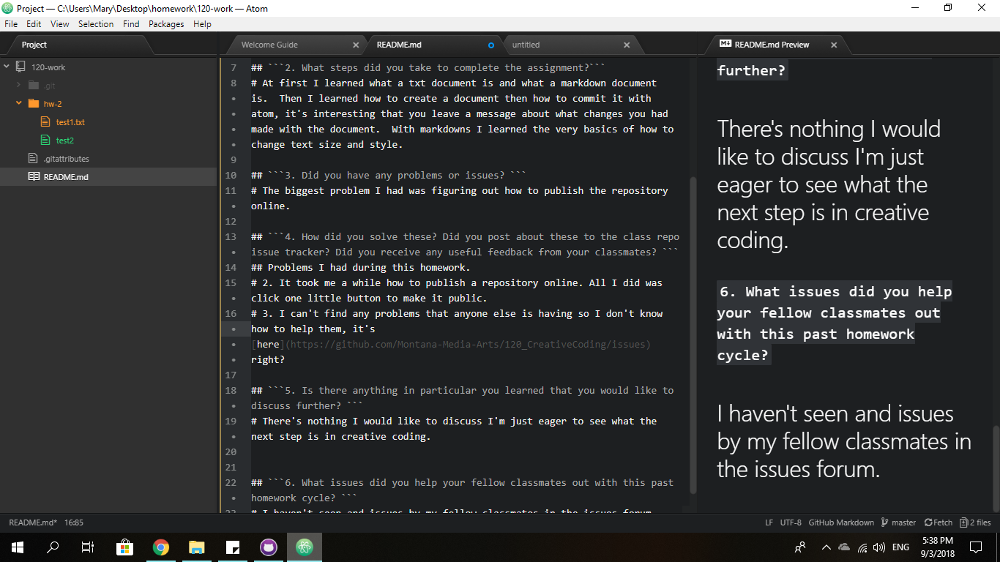

## Mary Primeau

## ```1. Summarize the work you did this homework cycle. Paying particular attention to the individual choices you made.```

# In this homework I learned about what Github and Atom are and how developers use these type of programs to solve problems. I also learned about how to create a repository.  The final thing I learned was about what a markdown file is and how it is used to create a stylized  document with fonts and sizes.

## ```2. What steps did you take to complete the assignment?```
# At first I learned what a txt document is and what a markdown document is.  Then I learned how to create a document then how to commit it with atom, it's interesting that you leave a message about what changes you had made with the document.  With markdowns I learned the very basics of how to change text size and style.

## ```3. Did you have any problems or issues? ```
# The biggest problem I had was figuring out how to publish the repository online.

## ```4. How did you solve these? Did you post about these to the class repo issue tracker? Did you receive any useful feedback from your classmates? ```
## Problems I had during this homework.
# 2. It took me a while how to publish a repository online. All I did was click one little button to make it public.
# 3. I can't find any problems that anyone else is having so I don't know how to help them, it's [here](https://github.com/Montana-Media-Arts/120_CreativeCoding/issues) right?

## ```5. Is there anything in particular you learned that you would like to discuss further? ```
# There's nothing I would like to discuss I'm just eager to see what the next step is in creative coding.


## ```6. What issues did you help your fellow classmates out with this past homework cycle? ```
# I haven't seen any issues by my fellow classmates in the issues forum.

Here's an image of me doing the homework 
