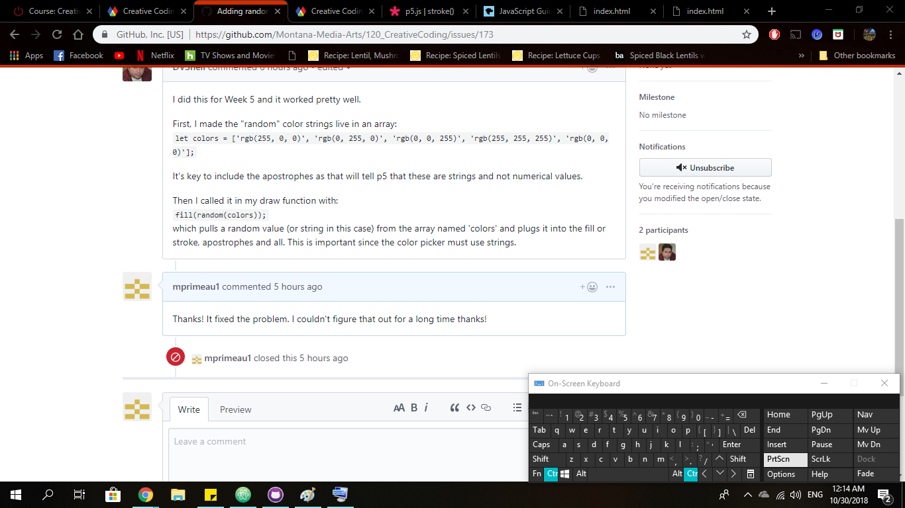

# Mary Primeau
# HW-10 Functions

# [Live Sketch Link](https://mprimeau1.github.io/120v2/HW10/index.html)

## I took my week 5 animation, I picked this animation because I always thought I could do more to it. I created four functions, one for the penguins, one for the red balloons, the floating ice burgs, and the snow blinking. In the parameters for the red balloons and penguins I changed there positions and scale six times in random positions.  It took me awhile to perfectly place the penguins and coordinating balloons, but it the end it was totally worth it.  I did have a problem with the eyes of the penguins, at point all of there eyes started blinking the colors of the snowflakes.   All I needed to do was to change the fill color to white and problem was solved.  For the snow flakes I created a loop in the snow function so that when the mouse moves the positions on the snow flakes move a bit on the screen.  The snow flakes also have an awesome random colorization of light colored snow(and it's stroke), that randomly blink.  I had to write on the issues forum about random colorization.  Ultimately it was a simple solution that I had overlooked, and need to great a let statement. Here is a picture of the issue in the forum. 

## For the ice burgs I added two more floating ice burgs into the mix, then changed it so that they and there stroke both randomly change color.  I think that overall my sketch looks better than before and I learned a lot about functions.
