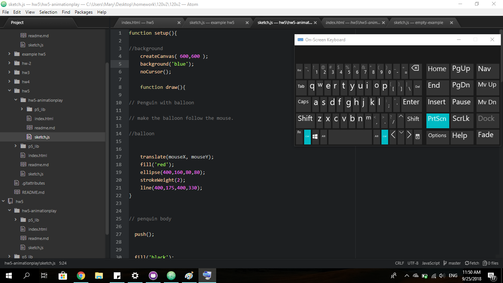

# Mary Primeau
# HW-5 Create an Animation

## This week in coding I created a simple animation.  In the animation I created a penguin holding a red balloon that follows the cursor, and an ice burg that floats along the bottom of the screen.  The biggest challenge I faced this week was making my penguin into the cursor. It took me a long time to figure out and even posted on the issues forum.  I knew that something was wrong in the beginning of my code where.  Here's an image of my code before I fixed my problem.

## Once I fixed my cursor problems I played around in Atom and struggled to add more animation.  Eventually I decided to add a floating ice burg on the bottom of the screen. I learned about loop and how many frames per second to add an animation. I feel like I have improved my coding from last weeks image as simple as it might be.
